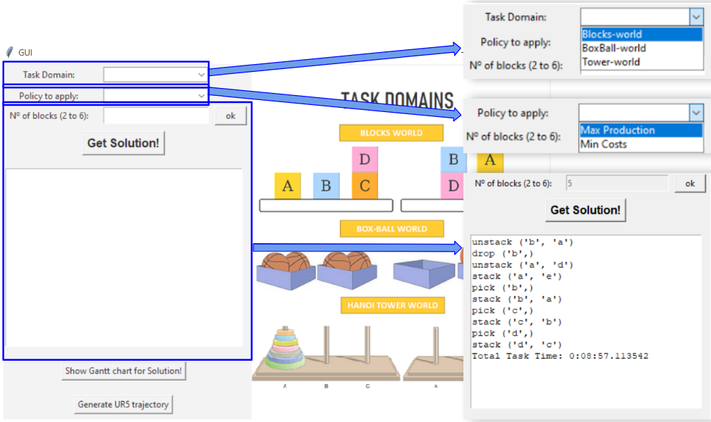

# TaskPlanner_UR5
PDDL based Task planner for UR5 robot

Allows to define a goal task (Block stacking, Boxing Balls, or Hanoi Tower) and automatically generates a plan of sequential operations to achieve the  goal task. It also generates the respective trajectory for UR5 robot, connecting to URSim and executing the movements.

## Source
- [action.py](action.py) action class
- [pddl.py](pddl.py) pddl parser
- [planner.py](planner.py) breadth-first search as planner
- [action_ur5_trans.py](action_ur5_trans.py) Plan-UR5 path translator to URSim
- [gui.py](gui.py) Tkinter GUI for user interface
- [plan_files](plan_files/) folder with PDDL (task) domains and problems

## Dependencies
* [Python 3.7](https://www.python.org/downloads/release/python-37/)
* Tkinter (for the graphical interface)
* [Plotly](https://github.com/plotly/plotly.py) for the Gantt Chart plot
* IDE [PyCharm - Community Edition](https://www.jetbrains.com/pycharm/download/)
* [URSim 3.12.1](https://www.universal-robots.com/download/?option=18940)

## What it does:
TaskPlanner_UR5 opens a Graphical User Interface (GUI) for selecting a Task domain, number of blocks/disks/balls, and policy, then generating the operation sequence to obtain the goal task/state.  



You can also generate the gantt chart for the generated plan, and the corresponding UR5 trajectory and execute it in URSim.


## Usage
- Before running the code, start the URSim and enable the ethernet of the UR5 robot inside the simulator
- Execute the main program
```bash
 python gui.py
```

